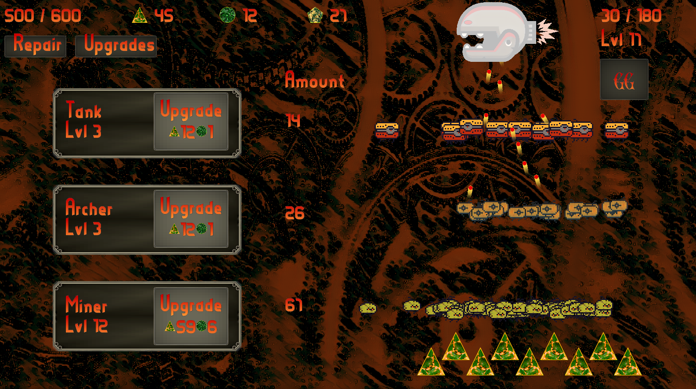

# ClickPunk

**_by_**

Beschreibung:

Unser Spiel handelt von einer Fabrik zur Erstellung von Tanks, Schützen und Sammlern, die ständig von Monstern angegriffen wird, welche diese lahmzulegen versuchen. 

Über Upgrades kann die Fabrik immer weiter ausgebaut werden. Dafür gibt es drei Arten von Loot, eine wird von den Sammlern abgebaut, zwei werden den Monstern eine Menge an Loot abgetrotzt.

Durch strategische Entscheidungen kann der unvermeidliche Untergang im Angesicht der Monsterhorde noch etwas herausgezögert werden, doch am Ende geht das Spiel in eine Direktion: GG drücken und mit besseren Stats neu probieren. 

Screenshot:

Credits gehen raus an:
* https://opengameart.org/users/bevouliincom
* https://wallpaper.dog/gearss
* https://mounirtohami.itch.io/
